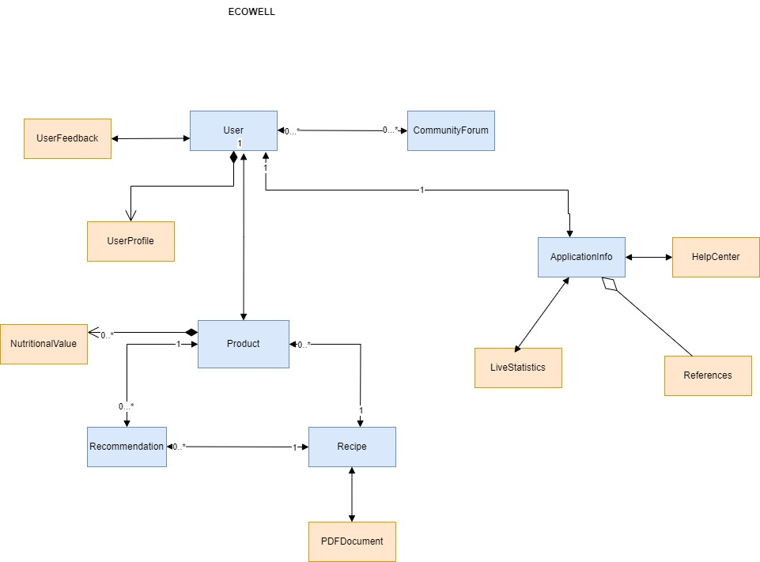
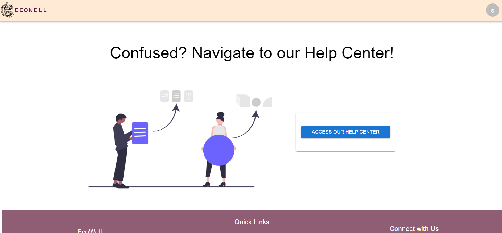

<h2>EcoWell</h2> 

<b>Team Details: Pace Makers </b> 
Yashwanth Behera - NUID 002299461  
Sanskruti Manoria - NUID 002643300  
Venkata Deepak Viswanadha - NUID 002299829  
Nikitha Kambhampati - NUID 002272863   

EcoWell is a cutting-edge application designed for nutritional analysis of food items, putting the power of information and healthy choices in your hands. Simply input a product's barcode id, and EcoWell seamlessly connects to Open Food APIs, providing detailed nutritional facts and ingredient information.   

Video link: https://github.com/info-6150-fall-2023/final-project-pace-makers/blob/main/Final%20Project%20Submission%20-%20EcoWell.mp4

<b>Introduction </b>  
The goal of our project is to create a comprehensive and user-friendly web application that focuses on promoting health consciousness and well-being. Application focuses on peforming Nutritional Analysis, getting simillar recommendations and recipies. By leveraging a variety of addtional features like language translation ,export help center our application aims to provide users with personalized information, facilitate informed decision-making, and foster a community-driven platform for sharing health-related experiences and tips.   

<b>UML Diagram</b> 

 

<b>Key Features</b>  
1. Live application statistics  
2. Product Nutritional Analysis and Recommendations  
3. Personalized Product Recipes  
4. Secure Authentication and Authorization  
5. Routes Protection  
6. CRUD operations  
7. Multilingual support (English, Spanish, French) – Internationalization  
8. PWA  
9. PDF Download Functionality  
10. Profile Analytics  
11. Feedback System and Community Portal  
12. User friendly interface   

<b>Technologies Used</b> 
•Mongo DB 
•Express 
•Node js 
•React 
•Redux 
•Typescript 
•Javascript 
•Material UI 
•Postman  

<b>Application Use Cases</b>  
•Barcode ID Nutrition Lookup:  
Effortlessly retrieve comprehensive nutritional data and ingredients by scanning a product's barcode.  

  
•Related Products and Favorites: 
Discover related products based on your entries and mark your favorites for quick and personalized recommendations.  
 
•Customised Search on recipies :  
Tailor your preferences with filters like vegetarian or no sugar to receive recipe suggestions enriched with essential data such as calories and keywords. 
  
•PDF Recipe Downloads:  
Conveniently download PDFs of your favorite recipes for easy reference or sharing with friends.

•Help Center and User Guide: 
Navigate the app seamlessly with a detailed user guide available in the Help Center.

•Profile Analytics: 
Gain insights into your nutritional habits and preferences through personalized profile analytics based on the data entered during sign-up.
 
•Live App Data: 
Stay informed with real-time statistics on the app's usage, including the number of registered users and total available recipes.
 
•Multilingual Support: 
EcoWell supports both English and French languages, ensuring accessibility for a diverse user base.
 
•Community Forum and Feedback: 
Engage with like-minded users in the community forum, share experiences, and provide valuable feedback to enhance the app's features. 
•Secure Authentication and Authorisation: 
Safeguard your data with OAuth authentication, ensuring a secure and reliable login and sign-up process.
  

<b>Relatated API References</b> 
1. Product Information and Nutrition: 
    - [Open Food Facts](https://world.openfoodfacts.org/): A database of food products from around the world, including nutritional information. 
2. User Authentication: 
    - [Auth0](https://auth0.com/): A widely used identity and authentication platform. 
3. Dietary Preference: 
    - [Edamam Recipe Search API](https://developer.edamam.com/edamam-recipe-api): Provides detailed nutritional information for a given recipe, including whether it's vegetarian or not. 
4. Product Recommendation: 
    - [Open Food Facts - Product Recommendation API](https://world.openfoodfacts.org/): A database of food products from around the world, including nutritional information.  

<b>Instructions to run EcoWell</b>   
Backend Connection  
• Open terminal, navigate to RESTAPIServices folder   
• in terminal write "npm start"  
• It will connect to EcoWell db and will start listening port 5000  
Frontend Connection  
• Open terminal, navigate to client folder   
• in terminal write "npm start"  
• It will connect to EcoWell and will start listening port 3000   

<b>Instructions to use EcoWell Application (User guide)</b> 
Landing Page 
    1. Check the Fast facts section whic displays current dynamic status and report of application. 
    2. Login : scroll down to Google sign, enter your email id and password.  
    3. Enter your details to the user details page to proceed in the application (sign up) 
Home page- personalised page of logged in user 
    4. For Nutritional Analysis 
     -Enter the Barcode id found on the backside of food product, Click Submit 
     -Your will be redirected to product details page with a detailed view of poduct ingredients, nutrinal Facts  
    5. For Product Recommendation 
    - Conitinuing to above steps, scroll down and click on button- get product recommendations 
    - EcoWell will give you list of recommendaed products simillar to the one you entered. 
    6. For Filtered search and adding to favourites: 
    -Following above, you will get a filter page where you can select the filtes and click on the search button. 
    -You will get the filtered list of product with thier nutrient information.  
    -You can add them as favourites and get the results on homepage. 
    7. Profile Analytics:  
    -Back to home page, You can see the dynamic charts giving results based on your profile data and favourite recipies. 
    8. Export: 
    -Scroll down to export section, You can download the list of favourite reciepes as a pdf. 
    9. Community Forum: 
    -This section is for user collaboration in the application. Give the list of all the posts made my users of the application. 
    -Click on Join button which will be redirecting to community portal page. 
    -Click on creat Post to add a new post. 
    - A user can update and delete thier own posts only. 
    10. Help Center: 
    -Scroll down to help center for application user guide.This section focus on three language - French , English and Spanish. 
    -Click on acces help center which will redirect to the Help center overview page. 
    -You can see each card which leads to different section of application and can read the content in 3 languages. 
    11. Update user Profile: 
    -Click on the user icon on the top right of the application 
    -Select update menu for updating your details. 
    12. PWA : Download the application from the google link bar and run offline.  

  

    

